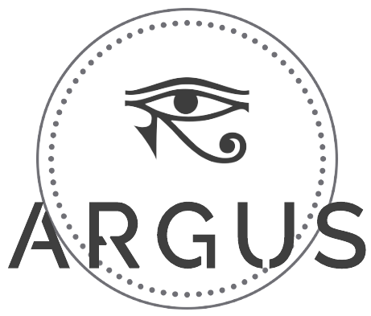

  

### Object detection PWA using Azure Cognitive Services

Activates camera in mobile phones, and whenever it detects an object nearby, it will vibrate and announce the object name.

### Installation
1. Run `git clone https://github.com/jasonwvh/argus.git`

3. Run `npm install`

5. Create a file called '.env' in the same folder as package.json and copy the following code:

`
HTTPS=true

REACT_APP_TS_KEY=<your-Azure-Speech-key>

REACT_APP_CV_KEY=<your-Azure-Computer-Vision-key>

REACT_APP_CV_ENDPOINT=<your-Azure-Computer-Vision-endpoint>
`

and change `var serviceRegion = 'westus'` in `RenderVideo.js` into appropriate location.

4. Run `npm start`
